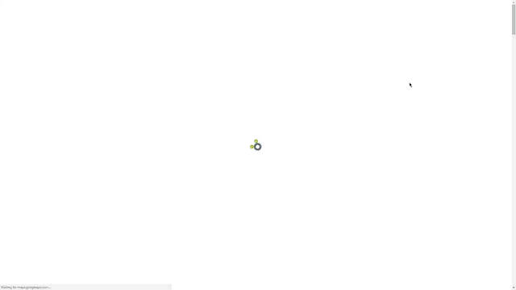

<p align="center">
  <a href="https://github.com/akhilrajmailbox/MyResume/releases"></a>
  <a href="https://github.com/akhilrajmailbox/MyResume/blob/master/LICENSE"></a>
  
  
</p>

<p align="center">
  <h1 align="center">CV, Resume and Portfolio website template</h1>
</p>

<p align="center">
  <a href="https://akhilraj.me/">
    
  </a>
</p>

<!-- # Best-in-Class modern CV, Resume and Portfolio # -->

:mortar_board: Best in Class modern CV, Resume and Portfolio website template.
All-in-One-Page site with simple and fully customizable builder.

`modern` `cv` `resume` `portfolio` `template` `portfolio-website` `cv-template` `IT` `cv-summary` `resume-template` `resume-website` `cv-website` `animated` `template-project`

---

## :computer: Live Demo ##
See it in action at :point_right: [Modern CV](https://akhilraj.me/) :point_left:

---

## What Is a Curriculum Vitae? ##

`Curriculum vitae` (CV) provides a summary of one’s experience and skills.

CVs include information on one’s academic background, including teaching experience, degrees, research, awards, publications, presentations, and other achievements. CVs are thus much longer than resumes, and include more information, particularly related to academic background.

A curriculum vitae summary is a one-to-two-page, condensed version of a full curriculum vitae. A CV summary is a way to quickly and concisely convey one’s skills and qualifications. Sometimes large organizations will ask for a `one-page CV` summary when they expect a large pool of applicants.

Full article about what is [Curriculum vitae](https://www.thebalancecareers.com/cv-vs-resume-2058495)

---

## :runner: Usage ##

### 1. Clone the repository and enter its directory ###
```shell
$ APP_NAME=MyResume \
&& git clone https://github.com/akhilrajmailbox/${APP_NAME}.git \
&& cd ${APP_NAME}
```

### 2. Install the dependencies ###
```shell
$ make setup
```

### 3. Configure ###

Replace values in `config/person.json` with your personal information

### 4. Build ###
```shell
$ make build
```

### 5. Deploy ###
```shell
$ make deploy
```

This will create/update `webroot` directory inside the project root.
Use this directory as DocumentRoot in VirtualHost configuration of your web server.

### 6. Enjoy  ###

Post a link to your CV on sites where you need your personal profile page should be discovered by other users and that provide a lots of information about your professional skills and experience.
For example: [Modern CV](https://akhilraj.me/)

---

## :label: Components ##

 Name | Version | Scope | Description |
:-----|:-------:|:-----:|:------------|
 [animate.css](http://daneden.github.io/animate.css/) | 3.7.2 | Front | A cross-browser library of CSS animations
 [FontAwesome](https://fontawesome.com/) | 5.10.1 | Front | The iconic Font and CSS toolkit
 [Bootstrap](http://getbootstrap.com) | 3.3.7 | Front | Front-end framework for developing responsive, mobile first projects on the web
 [jQuery](http://jquery.com/) | 3.4.1 | Front | JavaScript Library
 [noty](http://ned.im/noty) | 2.4.1 | Front | Notification library
 [waypoints](https://github.com/imakewebthings/waypoints) | 4.0.1 | Front | Easily execute a function when you scroll to an element
 [wow.js](https://wowjs.uk/) | 1.3.0 | Front | Reveal CSS animation as you scroll down a page
 [iamx](https://trendytheme.net/items/i-am-x-html-resume-template/) | 1.2.0 | Front | Trendy Theme

## :wrench: Dev Tools ##

 Name | Description |
:-----|:------------|
 [bower](http://bower.io) | A package manager for the web
 [gulp](http://gulpjs.com) | Toolkit for automating tasks in development workflow
 [gulp-token-replace](https://github.com/Pictela/gulp-token-replace) | Token replace plugin for Gulp
 [jimp](https://github.com/oliver-moran/jimp) | An image processing library written entirely in JavaScript for Node
 [terser](https://github.com/terser-js/terser) | A JavaScript parser and mangler/compressor toolkit for ES6+

---

## :pushpin: Todo List ##

- [ ] - upgrade to noty v3
- [ ] - upgrade to bootstrap v4
- [ ] - implement require.js configuration
- [ ] - upgrade gulp to v4

---


## Github page for your CV

* clone this repo to your local and make appropriate changes
* create the artifacts for your github page / attractive resume page with animation by [execute these commands](https://github.com/akhilrajmailbox/MyResume/tree/master/DockerEnv)
* copy the `webroot` folder contents to `docs` and push it to your repo. `cp -r webroot/* docs/`

Read [LICENSE](https://github.com/akhilrajmailbox/MyResume/blob/master/LICENSE.md) for copyright information